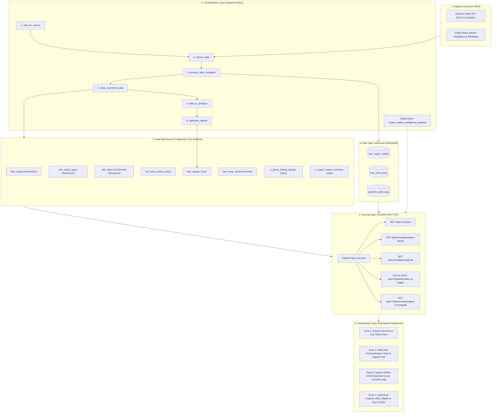
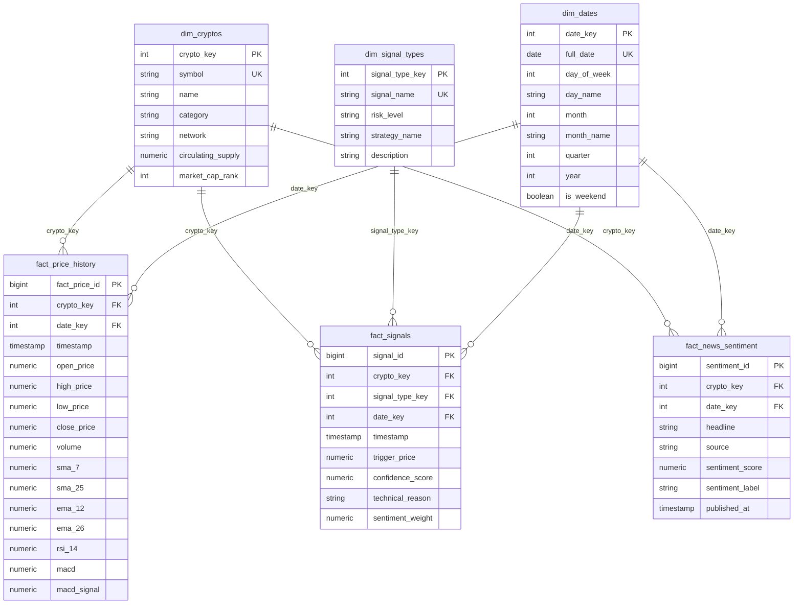

# 🚀 CRYPTO PULSE: Market Trends & Trading Signal Intelligence Platform
### *End-to-End Data Engineering & Algorithmic Intelligence Platform*

[](https://www.python.org/)
[](https://fastapi.tiangolo.com/)
[](https://airflow.apache.org/)
[](https://www.postgresql.org/)
[](https://www.mongodb.com/)
[](https://www.docker.com/)

---

## 🇹🇭 สรุปภาพรวมโปรเจค (Project Overview - TH)

**Crypto Pulse** คือโปรเจคระบบ Data Engineering และ Data Analytics แบบ End-to-End ที่ออกแบบมาเพื่อดึงข้อมูลราคา Cryptocurrency (OHLCV) และข่าวสารความเคลื่อนไหวในตลาดแบบ Real-time นำมาผ่านกระบวนการ **ETL (Extract - Transform - Load)** คำนวณ Feature Engineering ทางเทคนิค (SMA, EMA, RSI, MACD) และวิเคราะห์ NLP Sentiment เพื่อสร้างสัญญาณเทรดเชิงปริมาณ (**Quantitative Trading Signals**)

### 💡 จุดเด่นด้านวิศวกรรมข้อมูล (Data Engineering Highlights):
1. **Dual Storage Lakehouse Architecture:** จัดเก็บข้อมูลดิบ (Raw JSON/BSON) ลงใน **MongoDB** เพื่อรองรับ Schema Evolution และ Data Lineage ขณะที่ข้อมูลที่ผ่านการ Transform แล้วจะถูกจัดเก็บลงใน **PostgreSQL Data Warehouse** ด้วยโมเดล **Star Schema** (Fact & Dimension Tables)
2. **Orchestration with Apache Airflow:** ควบคุมลำดับการทำงานของ Data Pipeline ด้วย **Airflow DAG** จัดการ Task Dependencies, Health checks, Retry logic, และ Data validation
3. **Quantitative Signal Confluence Engine:** อัลกอริทึมวิเคราะห์สัญญาณเทรดแบบ Confluence (วิเคราะห์จุดตัดเส้นค่าเฉลี่ย Golden/Death Cross, ระดับ RSI Extremes, ร่วมกับคะแนน NLP Sentiment ของข่าว) ให้ผลลัพธ์เป็น `STRONG_BUY`, `BUY`, `HOLD`, `SELL`, `STRONG_SELL` พร้อมค่า Confidence Score (0–100%)
4. **REST API & Interactive Cyberpunk Dashboard:** พัฒนา Backend ด้วย **FastAPI** เพื่อส่งมอบข้อมูลผ่าน REST APIs และสร้างหน้าเว็บ Dashboard แบบ Dark Glassmorphism 4 โซน (Live Tickers, Interactive Charts, Airflow DAG Monitor, Lakehouse Table/JSON Explorer)
5. **Dual-Mode Execution:** รองรับการรันแบบ **Docker Compose** สำหรับ Production และ **Zero-Dependency Local Mode** (รันด้วย Python 1 คำสั่งผ่าน Embedded SQLite Warehouse + JSON Lakehouse)

---

## 📑 Table of Contents
- [1. System Architecture](#1-system-architecture)
- [2. Data Engineering Skills & Concepts](#2-data-engineering-skills--concepts)
- [3. Database Architecture & Schema Design](#3-database-architecture--schema-design)
  - [PostgreSQL Star Schema (Data Warehouse)](#postgresql-star-schema-data-warehouse)
  - [MongoDB Raw Document Store (Data Lakehouse)](#mongodb-raw-document-store-data-lakehouse)
- [4. Pipeline Orchestration (Apache Airflow)](#4-pipeline-orchestration-apache-airflow)
- [5. Feature Engineering & Signal Engine](#5-feature-engineering--signal-engine)
- [6. REST API Reference](#6-rest-api-reference)
- [7. Web Dashboard (4 Zones)](#7-web-dashboard-4-zones)
- [8. Installation & Quick Start Guide](#8-installation--quick-start-guide)
- [9. Project Structure](#9-project-structure)

---

## 1. System Architecture



---

## 2. Data Engineering Skills & Concepts

| Skill / Domain | Core Concepts | Implementation Details |
| :--- | :--- | :--- |
| **ETL & Data Transformation** | Ingestion, Cleaning, Imputation, Date Key Derivation, Indicator Calculation | `pipeline/extract.py`, `pipeline/transform.py` using Pandas & NumPy |
| **Data Warehousing (DWH)** | Star Schema, Dimensional Modeling, Conformed Dates, Idempotent Upsert | `database/postgres/01_init_schema.sql`, `pipeline/load.py` |
| **NoSQL & Data Lakes** | Raw Document Staging, Lineage Auditability, Schema Evolution | `database/mongodb/01_init_mongo.js`, `pipeline/raw_storage.py` |
| **Pipeline Orchestration** | Directed Acyclic Graph (DAG), Task Retries, XCom, Simulation Runner | `dags/crypto_intelligence_pipeline.py`, `pipeline/orchestrator.py` |
| **Quantitative Analytics** | SMA, EMA, RSI-14, MACD, NLP Sentiment Lexicons, Confluence Scoring | `pipeline/signals.py`, `pipeline/transform.py` |
| **REST API Engineering** | FastAPI, Pydantic Type Validation, Async Background Tasks, CORS | `backend/main.py`, `backend/routers/` |
| **DevOps & Containerization**| Multi-Container Docker Compose, Port Forwarding, Healthchecks | `docker-compose.yml`, `Dockerfile.backend` |
| **Frontend Development** | Cyberpunk Dark Glassmorphism, Chart.js Multi-Axis, Real-time DOM | `frontend/index.html`, `frontend/styles.css`, `frontend/app.js` |

---

## 3. Database Architecture & Schema Design

### PostgreSQL Star Schema (Data Warehouse)

The relational warehouse is modeled in a **Star Schema** to optimize OLAP analytical querying and BI dashboard performance:



### MongoDB Raw Document Store (Data Lakehouse)
Unstructured payloads are preserved in raw BSON format across 3 collections:
- `raw_crypto_market`: Complete API response envelopes with raw prices, volume, and batch tracking ID.
- `raw_news_feed`: Raw unstructured headlines and metadata prior to NLP parsing.
- `pipeline_audit_logs`: Ingestion timestamps, record counts, and run statuses for data governance.

---

## 4. Pipeline Orchestration (Apache Airflow)

The ETL pipeline runs under an automated Airflow DAG (`crypto_market_intelligence_pipeline`) with explicit task dependencies:

$$\text{wait\_for\_source} \longrightarrow \text{extract\_data} \longrightarrow \text{process\_data\_mongodb} \longrightarrow \text{clean\_transform\_data} \longrightarrow \text{load\_to\_postgres} \longrightarrow \text{generate\_signals}$$

1. **`wait_for_source`**: Validates upstream API health and network availability.
2. **`extract_data`**: Queries external exchange endpoints for tracked symbols (`BTC`, `ETH`, `SOL`, `BNB`, `ADA`, `XRP`).
3. **`process_data_mongodb`**: Stages raw JSON payloads into the MongoDB Lakehouse for auditability.
4. **`clean_transform_data`**: Deduplicates records, imputes missing values, extracts date keys (`YYYYMMDD`), and computes technical features.
5. **`load_to_postgres`**: Upserts dimensions and facts into the PostgreSQL Star Schema.
6. **`generate_signals`**: Evaluates quantitative multi-factor signals and refreshes analytical views.

---

## 5. Feature Engineering & Signal Engine

### 1. Technical Indicators Calculated:
- **Simple Moving Averages (SMA):**
  $$\text{SMA}_n = \frac{1}{n} \sum_{i=0}^{n-1} P_{t-i} \quad (n = 7, 25)$$
- **Exponential Moving Averages (EMA):**
  $$\text{EMA}_t = P_t \times \alpha + \text{EMA}_{t-1} \times (1 - \alpha), \quad \alpha = \frac{2}{N+1} \quad (N = 12, 26)$$
- **Relative Strength Index (RSI 14):**
  $$\text{RSI} = 100 - \left( \frac{100}{1 + \text{RS}} \right), \quad \text{RS} = \frac{\text{Average Gain}}{\text{Average Loss}}$$
- **MACD (Moving Average Convergence Divergence):**
  $$\text{MACD Line} = \text{EMA}_{12} - \text{EMA}_{26}, \quad \text{Signal Line} = \text{EMA}_9(\text{MACD})$$

### 2. Confluence Trading Signal Rules:
- **Golden Cross ($\text{SMA}_7 > \text{SMA}_{25}$ crossover) + RSI $\le 35$ + Bullish Sentiment** $\longrightarrow$ **`STRONG_BUY`** (Confidence: 85–98%).
- **Bullish Trend ($\text{SMA}_7 > \text{SMA}_{25}$) + Positive MACD** $\longrightarrow$ **`BUY`** (Confidence: 65–85%).
- **Death Cross ($\text{SMA}_7 < \text{SMA}_{25}$ crossover) + RSI $\ge 68$ + Bearish Sentiment** $\longrightarrow$ **`STRONG_SELL`** (Confidence: 85–98%).
- **Bearish Breakdown ($\text{SMA}_7 < \text{SMA}_{25}$)** $\longrightarrow$ **`SELL`** (Confidence: 65–85%).
- **Range-bound Consolidation** $\longrightarrow$ **`HOLD`** (Confidence: 50–65%).

---

## 6. REST API Reference

FastAPI provides automatic interactive Swagger documentation at `http://localhost:8000/docs`.

| Method | Endpoint | Description |
| :--- | :--- | :--- |
| `GET` | `/api/v1/cryptos` | List of all tracked assets with current price, 24h change %, RSI, and sentiment |
| `GET` | `/api/v1/analytics/price-trends?symbol=BTC&days=30` | Time series OHLCV with SMA-7, SMA-25, EMA-12, EMA-26, RSI-14, MACD |
| `GET` | `/api/v1/analytics/signals` | Latest algorithmic trading signals with confidence scores & technical rationale |
| `GET` | `/api/v1/analytics/summary` | Market mood index (0–100), signal distribution breakdown, and sentiment stats |
| `GET` | `/api/v1/pipeline/status` | Current Airflow DAG execution state, task nodes progress, and logs |
| `POST` | `/api/v1/pipeline/trigger` | Trigger immediate on-demand execution of the ETL pipeline |
| `GET` | `/api/v1/pipeline/logs` | Full historical execution audit log stream |
| `GET` | `/api/v1/lakehouse/postgres/tables` | List all Star Schema tables and row counts |
| `GET` | `/api/v1/lakehouse/postgres/{table_name}` | Query tabular data for any warehouse table/view with pagination |
| `GET` | `/api/v1/lakehouse/mongodb/collections` | List available MongoDB Lakehouse collections |
| `GET` | `/api/v1/lakehouse/mongodb/{collection_name}` | Inspect raw JSON document tree payloads |

---

## 7. Web Dashboard (4 Zones)

The web interface is engineered with a **Cyberpunk / Bloomberg Terminal Glassmorphism aesthetic** organized into 4 distinct functional zones:

- **Zone 1: Real-Time Market Overview & Asset Health:** Live price cards for BTC, ETH, SOL, BNB, ADA, XRP with 24h change badges, Fear & Greed sentiment gauge, and Star Schema total row counters.
- **Zone 2: Technical Feature Engineering & Quantitative Signals:** Multi-axis interactive Chart.js line and candlestick trend charts with toggles for SMA-7, SMA-25, and RSI-14 sub-chart, accompanied by a Signal distribution donut chart and live trading signal cards.
- **Zone 3: Apache Airflow DAG Orchestration & Execution Monitor:** Flowchart DAG node visualizer with animated pulsating glows for active tasks (`QUEUED` $\rightarrow$ `RUNNING` $\rightarrow$ `SUCCESS`), execution duration timers, a manual **"Trigger DAG Run"** button, and an auto-scrolling log console.
- **Zone 4: Data Lakehouse & Star Schema Explorer:** Dual-mode interactive data viewer allowing users to toggle between PostgreSQL Star Schema SQL tables and MongoDB raw JSON document trees with syntax styling and one-click copy.

---

## 8. Installation & Quick Start Guide

### Option A: One-Command Local Run (Zero External Dependencies)
This mode utilizes the embedded SQLite warehouse and JSON Lakehouse storage so you can run the entire platform instantly on any machine without installing Docker:

```bash
# 1. Clone repository
git clone https://github.com/satetapongsa/DATA_CRYPTO_PULSE.git
cd DATA_CRYPTO_PULSE

# 2. Install Python dependencies
pip install -r requirements.txt

# 3. Launch the platform
python run.py
```
Open your browser at: **`http://localhost:8000`**

---

### Option B: Production Containerized Run (Docker Compose)
This spins up PostgreSQL 16, MongoDB 7.0, Apache Airflow Webserver/Scheduler, and the FastAPI application in isolated containers:

```bash
# 1. Start all container services
docker-compose up -d --build

# 2. Access Web Services:
# • Web Dashboard & API:   http://localhost:8000
# • Airflow Webserver UI:   http://localhost:8080 (admin / admin)
# • PostgreSQL Warehouse:   localhost:5432 (postgres / postgres_secure_pass)
# • MongoDB Lakehouse:      localhost:27017 (root / mongo_secure_pass)
```

---

### CLI Pipeline Execution
You can also run the ETL pipeline independently from the command line:
```bash
python -m pipeline.run_pipeline --symbols BTC,ETH,SOL,BNB,ADA,XRP --days 30
```

---

## 9. Project Structure

```
DATA_CRYPTO_PULSE/
├── docker-compose.yml              # Multi-container orchestration (Postgres, Mongo, Airflow, App)
├── Dockerfile.backend              # Backend Dockerfile for FastAPI runtime
├── requirements.txt                # Python package dependencies
├── .env.example                    # Environment variable configuration template
├── .gitignore                      # Git ignore configuration
├── run.py                          # One-command root application launcher
├── README.md                       # Comprehensive project documentation
│
├── database/                       # Database initialization & DDL scripts
│   ├── postgres/
│   │   ├── 01_init_schema.sql      # Star Schema DDL (dim_cryptos, fact_price_history, views)
│   │   └── 02_seed_data.sql        # Initial dimension seed data
│   └── mongodb/
│       └── 01_init_mongo.js        # MongoDB collections & indexes initialization
│
├── dags/                           # Apache Airflow Orchestration DAGs
│   └── crypto_intelligence_pipeline.py # Airflow DAG with full task dependencies
│
├── pipeline/                       # Data Engineering Pipeline Modules
│   ├── __init__.py
│   ├── config.py                   # Environment & storage configuration
│   ├── extract.py                  # API ingestion (Binance, CoinGecko, News streams)
│   ├── raw_storage.py              # Staging to MongoDB Lakehouse
│   ├── transform.py                # Data cleaning & feature calculation (SMA, EMA, RSI, MACD)
│   ├── signals.py                  # Algorithmic Trading Signal Confluence engine
│   ├── load.py                     # Idempotent dimensional loader into Data Warehouse
│   ├── orchestrator.py             # Airflow simulation engine & execution state tracking
│   └── run_pipeline.py             # CLI pipeline runner
│
├── backend/                        # FastAPI REST Serving Layer
│   ├── __init__.py
│   ├── main.py                     # FastAPI app, CORS, static routes, and lifespan bootstrap
│   ├── database.py                 # Warehouse & Lakehouse unified query manager
│   ├── schemas.py                  # Pydantic request/response validation models
│   └── routers/
│       ├── cryptos.py              # GET /api/v1/cryptos
│       ├── analytics.py            # GET /api/v1/analytics/price-trends & /signals
│       ├── pipeline.py             # GET /api/v1/pipeline/status & POST /trigger
│       └── lakehouse.py            # GET /api/v1/lakehouse/postgres & /mongodb
│
└── frontend/                       # Presentation Layer (Interactive Dashboard)
    ├── index.html                  # Cyberpunk Glassmorphic Dashboard layout
    ├── styles.css                  # Custom design system with glowing neon theme
    └── app.js                      # Chart.js charts, live DAG visualizer, Lakehouse explorer
```

---

## 👨‍💻 Author & Contact
- **Project:** Crypto-Market Trends & Trading Signal Intelligence Platform (Crypto Pulse)
- **GitHub Repository:** [https://github.com/satetapongsa/DATA_CRYPTO_PULSE](https://github.com/satetapongsa/DATA_CRYPTO_PULSE)
- **Role:** Data Engineer / Database Architect / Full-Stack Developer
